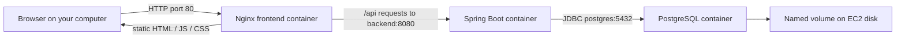

# BetterF deployment code, explained

[Start with the setup walkthrough](README.md) · [Operations reference](OPERATIONS.md)

This chapter explains the initial deployment from `d7157b7` plus the subsequent local versioning improvement documented in [the versioning guide](../../../architecture/versioning.md). Each section links to the full implementation; excerpts below focus on the lines that establish behavior. Source code and observed workflow results are the basis for the project-specific explanations.

## 1. Follow one change from your editor to the browser

Suppose you edit a heading under `app/frontend/src/` and push it to `develop`.

```mermaid
flowchart TD
    A[Mac: git push to develop] --> B[GitHub discovers .github/workflows/ci.yml]
    B --> C[verify: build, tests, type checking, browser checks]
    C --> D[Upload JAR and compiled website as artifacts]
    D --> E[publish: download artifacts into small build contexts]
    E --> F[Build images and push to GHCR]
    F --> G[Pass exact image digests to deploy]
    G --> H[GitHub OIDC identity exchanged for AWS credentials]
    H --> I[SSM sends command to EC2]
    I --> J[/opt/betterf/deploy.sh]
    J --> K[Compose pulls images and waits for healthy services]
    K --> L[Nginx serves the new website]
```

The app does not run on the GitHub runner after the job finishes. The runner builds and coordinates; EC2 keeps running the containers. The server does not need a Git clone of the source or the frontend build tools.



There are two distinct journeys: deployment travels from GitHub to EC2, while user traffic travels from a browser through Nginx to Spring and PostgreSQL.

## 2. Where GitHub starts, and what YAML means

Open [`.github/workflows/ci.yml`](../../../.github/workflows/ci.yml).

```yaml
name: BetterF checks and deployment
on:
  push:
  pull_request:
  workflow_dispatch:
permissions:
  contents: read
```

`name` is the human-facing label. `on` declares events. `push` handles pushed commits; `pull_request` runs checks for pull request activity; `workflow_dispatch` enables explicitly requested runs. Our first deployment used `gh workflow run ci.yml --ref develop`.

A YAML mapping is `key: value`, indentation establishes nesting, and `-` introduces a list item. `run: |` holds a multi-line shell script. `uses:` invokes a packaged action; `with:` supplies its inputs. `${{ ... }}` is evaluated by GitHub Actions, while `$NAME` inside a shell script is interpreted by the shell.

Workflow files must live at the repository root under `.github/workflows/`. Our `deploy/` folder is an ordinary folder: the workflow uses explicit paths to find it. [GitHub workflow syntax](https://docs.github.com/en/actions/reference/workflows-and-actions/workflow-syntax)

### Jobs, steps and runners

```yaml
jobs:
  verify:
    runs-on: ubuntu-latest
  publish:
    needs: verify
  deploy:
    needs: publish
```

This abbreviated excerpt shows ordering; read the full file for each job's runner and steps. A runner is a machine assigned to execute a job. Each of our jobs has its own GitHub-hosted Ubuntu runner. Steps within a job share that job's working directory; separate jobs do not automatically share files.

`needs` makes `publish` wait for successful `verify`, and `deploy` wait for successful `publish`. If publishing is skipped by its condition, deployment is skipped too. A green overall run can therefore mean “checks passed, deployment skipped.” Inspect the actual job conclusions.

## 3. The verify job: build once, check, preserve outputs

The setup actions check out the repository and prepare Java 25, Gradle and Node 22.23.1. The Gradle wrapper is the project's chosen Gradle launcher. The Node cache uses `app/frontend/package-lock.json` as its dependency reference; cached dependency downloads speed work but do not represent a completed release.

### Backend

Runner step:

```yaml
working-directory: app/backend
run: ./gradlew check bootJar --no-daemon
```

| Part | What it accomplishes here |
|---|---|
| `working-directory` | Runs this shell command from the backend project |
| `./gradlew` | Uses the repository's Gradle wrapper |
| `check` | Executes the project's verification tasks, including backend tests |
| `bootJar` | Builds the executable Spring Boot JAR with its application dependencies |
| `--no-daemon` | Avoids keeping a reusable Gradle daemon beyond this build |

The output consumed by the workflow is `app/backend/build/libs/app.jar`. Gradle reads the root `VERSION` and keeps this filename stable. CI checks frontend version mirrors before building. A release bump does not require editing these paths.

### Frontend

Runner commands, in `app/frontend`:

```bash
npm ci
npm test
npm run typecheck
npm run build
npx playwright install --with-deps chromium
```

`npm ci` installs from the lockfile. The [package scripts](../../../app/frontend/package.json) map `test` to Jest, `typecheck` to TypeScript without emitted output, and `build` to Angular's build. Playwright installs Chromium and its Linux dependencies for browser testing. The deployable output is `app/frontend/dist/frontend/browser/`.

### Test a real local stack on the runner

The next workflow step enters `app/`, copies `.env.example`, and appends a new random CI-only database password. It starts PostgreSQL using **`app/compose.yaml`**, exports the environment variables, and launches the packaged JAR as a background process.

```bash
java -jar backend/build/libs/app.jar > /tmp/betterf-backend.log 2>&1 &
backend_pid=$!
trap 'kill "$backend_pid" 2>/dev/null || true; docker compose down -v' EXIT
```

`&` starts the backend in the background. `$!` is its process ID. `>` redirects output, and `2>&1` sends errors to the same log. The `trap` cleans up when the step exits. The `down -v` is appropriate here because this is a disposable CI database; copying that cleanup to EC2 would remove persistent application data.

The step polls `/actuator/health/readiness`, then executes Playwright tests. These checks exercise browser-to-backend communication on the runner. They do not themselves prove that EC2 networking or the Nginx image works; the later deployment checks cover that environment.

### Pass the tested files to another job

```yaml
- name: Preserve tested backend
  uses: actions/upload-artifact@v4
  with:
    name: backend-jar
    path: app/backend/build/libs/app.jar
    if-no-files-found: error
    retention-days: 3
```

The frontend has an equivalent upload named `frontend-browser`. An **artifact** is a file bundle transferred between jobs. It is different from a Docker image. `if-no-files-found: error` catches wrong output paths. Three-day artifact retention affects these intermediate bundles, not the published GHCR images.

The failure-only upload preserves test reports for diagnosis. Existing checks are retained rather than replaced with a deployment-only workflow.

## 4. Why other repository files do not enter the images

The `publish` job downloads those artifacts and prepares two staging folders:

```text
package/                         ← temporary directory on publish runner
├── backend/                     ← backend build context
│   ├── Dockerfile
│   └── app.jar
└── frontend/                    ← frontend build context
    ├── Dockerfile
    ├── nginx.conf
    └── browser/
        ├── index.html
        └── compiled assets ...
```

The workflow makes that structure with:

```bash
cp deploy/aws/backend.Dockerfile package/backend/Dockerfile
cp deploy/aws/frontend.Dockerfile package/frontend/Dockerfile
cp deploy/aws/nginx.conf package/frontend/nginx.conf
```

Then it declares `context: package/backend` and `context: package/frontend` in the respective build steps. A build context is the set of local files available to Docker's `COPY` instructions. The repository was checked out to obtain the Dockerfiles, but the entire checkout is not passed as either context.

This is the answer to “the repository contains more than code”: docs, architecture, `.git`, local settings and source trees are outside those two contexts. Application resources deliberately included by Gradle or Angular still enter their build outputs, so secrets must not be placed in source resources either. Files compiled into browser assets are visible to website users.

We build the application before packaging it. These are runtime Dockerfiles, not multi-stage Dockerfiles that compile the source inside Docker.

## 5. Read the backend Dockerfile

Full file: [`deploy/aws/backend.Dockerfile`](../../../deploy/aws/backend.Dockerfile).

```dockerfile
FROM eclipse-temurin:25-jre-noble
RUN apt-get update && apt-get install -y --no-install-recommends curl \
    && rm -rf /var/lib/apt/lists/* \
    && groupadd --gid 10001 app && useradd --uid 10001 --gid app app
WORKDIR /app
COPY --chown=app:app app.jar /app/app.jar
USER app
EXPOSE 8080
ENTRYPOINT ["java", "-XX:MaxRAMPercentage=65.0", "-jar", "/app/app.jar"]
```

| Instruction | Purpose |
|---|---|
| `FROM` | Starts with a Java 25 runtime on Ubuntu Noble |
| `RUN` | Installs curl for the health check, removes apt metadata, creates the app user |
| `WORKDIR` | Establishes `/app` as the container working directory |
| `COPY --chown` | Copies only the staged JAR and gives ownership to the app user |
| `USER app` | Runs the application as that unprivileged container user |
| `EXPOSE 8080` | Documents the service port; does not publish it on EC2 |
| `ENTRYPOINT` | Starts Java with the JAR whenever the container starts |

`MaxRAMPercentage=65.0` sizes the Java heap relative to available memory; it is not a cap on total process memory. Compose's `mem_limit: 1536m` limits the container. Java also needs non-heap memory, so the two values serve different purposes.

Dockerfile `RUN` executes during image construction. `ENTRYPOINT` executes later, when EC2 starts a container. The Java runtime travels inside the image; the EC2 host only needs Docker to launch it.

## 6. Read the frontend Dockerfile and Nginx configuration

Full files: [frontend Dockerfile](../../../deploy/aws/frontend.Dockerfile), [Nginx](../../../deploy/aws/nginx.conf).

```dockerfile
FROM nginx:stable-alpine
COPY nginx.conf /etc/nginx/conf.d/default.conf
COPY browser/ /usr/share/nginx/html/
EXPOSE 80
```

Nginx is a web server. The compiled Angular website consists of static files; the browser executes its JavaScript. This image serves those files and inherits Nginx's startup command. It does not run `ng serve` or install Node.

Nginx's responsibilities are visible in these excerpts:

```nginx
root /usr/share/nginx/html;
resolver 127.0.0.11 valid=10s ipv6=off;
set $backend http://backend:8080;

location /api/ {
    proxy_pass $backend$request_uri;
    proxy_set_header Host $host;
    proxy_set_header X-Forwarded-For $proxy_add_x_forwarded_for;
    proxy_set_header X-Forwarded-Proto $scheme;
}

location /actuator { return 404; }
location = /index.html { add_header Cache-Control "no-store"; }
location / { try_files $uri $uri/ /index.html; }
```

`/api/status` is forwarded to Spring with the original path. The browser calls the same host that served the website, avoiding a separate cross-origin API endpoint. Docker's internal DNS resolves the service name `backend`; the resolver and variable allow later requests to use a replacement container's address. `backend` is not a public DNS name your laptop can use.

Angular handles client-side routes such as `/status`. On a direct browser visit, Nginx falls back to `index.html`, letting Angular select the page. The index response avoids cache storage so clients can discover updated bundles. `/actuator` is deliberately blocked at the public proxy; inspect health from inside the backend container.

## 7. Read the EC2 Compose configuration

Full file: [`deploy/aws/compose.yaml`](../../../deploy/aws/compose.yaml).

```yaml
name: betterf-dev
services:
  backend:
    image: ${BACKEND_IMAGE:?BACKEND_IMAGE is required}
    depends_on:
      postgres:
        condition: service_healthy
    environment:
      DB_URL: jdbc:postgresql://postgres:5432/betterf
      DB_USER: betterf
      DB_PASSWORD: ${DB_PASSWORD:?DB_PASSWORD is required}
      SERVER_ADDRESS: 0.0.0.0
      SERVER_PORT: "8080"
```

This excerpt omits other services and settings. `name` gives the Compose project stable identity. `${NAME:?message}` requires a nonempty value before Compose can proceed. The deployment loads `DB_PASSWORD` from `secrets.env` and image references from `candidate.env` or `current.env`.

Compose substitution and container environment are separate: `--env-file` supplies values used while reading YAML, and the service's `environment:` mapping selects values to pass into the container. It does not automatically inject every env-file entry into every service.

| Setting in full file | Effect |
|---|---|
| PostgreSQL `image: postgres:17.6-alpine` | Uses the existing database version independently of app images |
| `postgres-data:/var/lib/postgresql/data` | Persists database files in a named Docker volume |
| Backend `DB_URL` | Uses Compose service DNS, not host loopback |
| `SERVER_ADDRESS: 0.0.0.0` | Lets other containers reach Spring's listener |
| Frontend `ports: ["80:80"]` | Publishes EC2 port 80 to frontend port 80 |
| No backend/database `ports` | Keeps 8080 and 5432 off the host's published ports |
| `restart: unless-stopped` | Restarts stopped processes according to Docker's restart policy |
| `healthcheck` | Gives Docker a command to evaluate service health |
| `x-logging: &logging`, `logging: *logging` | Reuses a YAML logging configuration across services |
| `max-size: 10m`, `max-file: 3` | Limits each container's JSON log rotation |

The named volume is normally `betterf-dev_postgres-data`, derived from project and volume names. Containers may be replaced without deleting it. The volume still resides on the EC2 disk; it is not an off-host backup or managed RDS database.

Startup dependencies wait for a healthy database before Spring, then healthy Spring before Nginx. They do not continually restart downstream services whenever a dependency becomes unhealthy. [Compose startup ordering](https://docs.docker.com/compose/how-tos/startup-order/)

The backend probe calls `/actuator/health/readiness`; its [application configuration](../../../app/backend/src/main/resources/application.yaml) includes the database in readiness. Liveness has a different purpose: whether the process itself is alive. The frontend probe checks that Nginx serves `/`; the deployment's final `/api/status` call checks the proxy-to-backend path.

## 8. Publishing: permissions, image names and digests

The gate in our workflow is:

```yaml
if: github.event_name != 'pull_request' && github.ref == 'refs/heads/develop' && vars.AWS_DEPLOY_ENABLED == 'true'
```

| Event / state | verify | publish and deploy |
|---|---|---|
| Pull request | Runs | Skipped |
| Push to another branch | Runs | Skipped |
| Push or manual run on develop; switch unset/false | Runs | Skipped |
| Push or manual run on develop; switch true | Runs | Eligible after successful checks |

The repository variable is an operational gate, not a replacement for branch restrictions or IAM trust. Disabling it prevents future eligible publication jobs; it does not stop an already-running deployment or shut down the app.

The publishing job alone receives `packages: write`. `docker/login-action` uses GitHub's automatically supplied `GITHUB_TOKEN`. No personal publish token is embedded in the workflow.

```bash
repository="${REPOSITORY,,}"
echo "backend=ghcr.io/${repository}-backend" >> "$GITHUB_OUTPUT"
```

Bash lowercases the repository name for registry naming. Writing to `$GITHUB_OUTPUT` exposes a named output to subsequent steps. The resulting names are `ghcr.io/samehadel/betterf-backend` and `ghcr.io/samehadel/betterf-frontend`.

The build action uses `platforms: linux/amd64`, matching our x86_64 EC2 instance. `push: true` uploads images. The tag is the Git commit SHA, while the build action's returned **digest** identifies the content published to the registry.

```yaml
outputs:
  backend: ${{ steps.names.outputs.backend }}@${{ steps.backend.outputs.digest }}
```

The deployment receives an image reference like `ghcr.io/samehadel/betterf-backend@sha256:…`. A commit SHA describes source history; an image digest describes image content. They are different hashes. Rebuilding the same commit can produce a new digest because base-image tags or downloaded packages can change. Digest deployment fixes the selected image for that run; full reproducible builds require more pinning.

## 9. Five identities, with different jobs

| Identity / credential | Used where | Purpose |
|---|---|---|
| Human GitHub CLI login | Mac | Push source and trigger/read workflows |
| `GITHUB_TOKEN` | publish runner | Push GHCR packages for this repository |
| Classic PAT with `read:packages` | EC2 root Docker login | Pull private GHCR images |
| GitHub OIDC → `betterf-github-deploy` | deploy runner | Send SSM commands and read results |
| EC2 instance role | EC2 SSM Agent | Register and communicate with Systems Manager |

The two AWS roles are particularly easy to confuse: the EC2 role lets the server participate in SSM, while the GitHub role lets the pipeline request a command on that server.

The trust policy answers “who may assume this role?” Our subject is:

```text
repo:Samehadel@24625713/betterf@1380628408:environment:development
```

The numeric IDs were verified from GitHub's OIDC settings. This repository uses immutable subjects, so a legacy name-only string would not match. The audience `sts.amazonaws.com` targets AWS's credential service. [GitHub OIDC subject reference](https://docs.github.com/en/actions/reference/security/oidc#immutable-subject-claims)

The permissions policy answers “what may that assumed role do?” Ours permits `ssm:SendCommand` for the one instance and `AWS-RunShellScript` document, plus `ssm:GetCommandInvocation` to retrieve the result. The document is AWS-managed, which is why its ARN has an empty account segment.

`id-token: write` allows the deploy job to request a signed GitHub identity token. AWS then checks the role's trust before issuing temporary credentials. It does not itself grant permission to EC2. The `development` environment restricts eligible branches to `develop`; the subject identifies the environment rather than embedding the branch.

## 10. From the GitHub runner to the server

Full helper: [`deploy/aws/send-deployment.py`](../../../deploy/aws/send-deployment.py).

The deploy job validates its three GitHub environment variables, configures AWS credentials, and invokes:

```yaml
env:
  INSTANCE_ID: ${{ vars.EC2_INSTANCE_ID }}
  BACKEND_IMAGE: ${{ needs.publish.outputs.backend }}
  FRONTEND_IMAGE: ${{ needs.publish.outputs.frontend }}
  AWS_PAGER: ""
run: python3 deploy/aws/send-deployment.py
```

The helper validates the instance ID and both GHCR digest references. It constructs a command equivalent to the following conceptual form, with actual digests substituted:

```text
/opt/betterf/deploy.sh BACKEND_IMAGE_DIGEST FRONTEND_IMAGE_DIGEST
```

`shlex.join` quotes arguments for the remote shell, while `json.dumps` encodes SSM parameters. `subprocess.run` calls AWS CLI using an argument list. These are different quoting boundaries; string concatenation alone would be fragile.

The AWS call is `ssm send-command`, targeting `AWS-RunShellScript`. SSM returns a command ID. The helper polls `get-command-invocation`, tolerates temporary `InvocationDoesNotExist` while results propagate, waits through pending states, and exits zero only for `Success`. Acceptance of the initial API request is not evidence of a successful deployment. [SSM command statuses](https://docs.aws.amazon.com/systems-manager/latest/userguide/monitor-commands.html)

| Timeout | In our implementation |
|---|---|
| SSM send timeout | 600 seconds for command delivery/start window |
| Remote document execution timeout | 900 seconds |
| Python polling deadline | 1,200 seconds |
| GitHub deployment job timeout | 25 minutes |
| Compose health wait | 300 seconds inside the remote script |

A local polling timeout does not prove the remote command stopped. Check its command ID before retrying. API calls themselves use AWS CLI defaults; these nested limits are not a single transactional deadline.

No source files or passwords are sent in the SSM command. It sends the installed script path and the two image references. The server obtains runtime configuration from its existing files and downloads images from GHCR.

## 11. The deployment script, step by step

Full script: [`deploy/aws/deploy.sh`](../../../deploy/aws/deploy.sh), installed at `/opt/betterf/deploy.sh`.

```bash
set -Eeuo pipefail
umask 077
cd /opt/betterf
exec 9>/opt/betterf/deploy.lock
flock -n 9 || { echo 'Another deployment is running'; exit 1; }
```

The shell options catch common failures, `umask` protects new files, and `cd` makes release-file paths predictable. File descriptor 9 holds a nonblocking lock until this process exits. `-E` supports inherited error traps, though this script defines no `ERR` trap. Conditional command failures are handled explicitly later; `set -e` is not a universal rollback mechanism.

The script requires exactly two arguments and validates their digest syntax. It then creates:

```bash
printf 'BACKEND_IMAGE=%s\nFRONTEND_IMAGE=%s\n' "$1" "$2" > candidate.env
```

`$1` and `$2` are the backend and frontend references. `candidate.env` records the attempted release. It contains no database password.

A helper function centralizes the Compose options:

```bash
compose() {
  docker compose --env-file /opt/betterf/secrets.env --env-file "$1" \
    -f /opt/betterf/compose.yaml "${@:2}"
}
```

Its first argument chooses the image-reference file; remaining arguments become the Compose operation. For example, `compose candidate.env pull backend frontend` pulls the two app images using the candidate references and server-side password configuration.

The script pulls before changing the running containers. Then:

```bash
if compose candidate.env up -d --wait --wait-timeout 300 && \
   curl --fail --silent --show-error --retry 6 --retry-delay 5 --retry-all-errors \
     http://127.0.0.1/api/status; then
  if [[ -f current.env ]]; then cp current.env previous.env; fi
  mv candidate.env current.env
```

`up -d` creates or updates containers in the background. `--wait` requires their health checks to pass, within the stated timeout. Curl retries the API request through Nginx. This curl checks HTTP success; it does not parse the response body or test every product feature.

On success, the old successful references become `previous.env`, and the candidate becomes `current.env`. On failure, the script exits nonzero, making SSM and GitHub report failure. It does not restore images or reverse database migrations automatically. Containers might already have changed even though `current.env` still describes the previous successful release.

GitHub concurrency and the EC2 lock prevent overlapping deployment execution through these paths. They do not guarantee newest-commit ordering: deliberately rerunning an older workflow can deploy older code. There is no zero-downtime or transactional release guarantee.

## 12. What changes require what action?

| You change | Required path to the running app |
|---|---|
| Backend or Angular source | Push/merge to develop; CI builds and deploys new images |
| Dockerfiles or `nginx.conf` | Same workflow builds updated images |
| `send-deployment.py` | Next deploy job uses the checked-out helper |
| `deploy.sh` or EC2 Compose YAML | Review and copy the changed file to EC2; then run a compatible deployment |
| IAM policy JSON in Git | Separately apply it in AWS IAM; Git alone does not change IAM |
| GitHub environment variables | Save in GitHub; future jobs consume them |
| Database password | Follow a database credential rotation procedure; editing env alone is insufficient |
| Tutorial prose | Changes documentation; current workflow has no path filter, so a develop push can still deploy |

## 13. Check your understanding

Try answering before reading the final column.

| Question | Answer |
|---|---|
| Where is the backend compiled? | On the verify runner, under `app/backend` |
| Why does publish download artifacts? | It has a different runner filesystem |
| Why is there no database Dockerfile? | Compose uses the official PostgreSQL image |
| Why not copy the whole repo into Docker? | The workflow passes only staged build outputs as context |
| Can the browser request `http://backend:8080`? | No; that DNS name belongs to the Docker network |
| What opens port 80? | Compose publishes the port, and the EC2 security group permits browser ingress |
| Does setting the deployment switch launch anything? | No; a push or explicit workflow event must follow |
| Does successful SSM submission prove the site is healthy? | No; the helper waits for the actual command result |
| Does rolling back an image undo a migration? | No; database compatibility must be reviewed separately |
| Why are AWS keys absent from GitHub secrets? | OIDC exchanges a signed workflow identity for temporary credentials |

Next: [verify and operate the running system](OPERATIONS.md).
