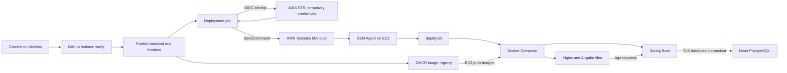

# BetterF DevOps course: from an empty EC2 instance to a working deployment pipeline

Prepared 3 October 2026. Audience: a developer learning DevOps for the first time.

## What you will build

You will establish a repeatable path from a Git commit to a running Spring Boot API and Angular frontend. GitHub Actions tests and packages the application, GHCR stores its images, AWS Systems Manager delivers deployment commands, and Docker Compose runs the application on EC2. PostgreSQL lives in Neon.

Think of a restaurant: Git is the recipe book, CI is the test kitchen, images are sealed prepared packages, GHCR is the warehouse, EC2 is the kitchen building, Compose is the equipment arrangement, and the deployment script is the opening checklist. IAM determines which staff may perform which duties. Network rules control which doors accept visitors. These analogies introduce responsibilities; they are not exact models of security or container isolation.

**Course endpoint:** a successful pipeline and a working app verified on EC2 and optionally through a private browser tunnel. Public HTTPS is a separate completion milestone, not something opening port 443 achieves by itself.

### Read this before executing examples

- Use AWS account `975050244178`, region **`eu-central-1` (Frankfurt)**, and your **new instance ID**. Verify the account belongs to you before applying policies.
- Replace every `NEW_INSTANCE_ID` and `YOUR_...` placeholder. Never paste actual credentials into Git, chat, or workflow logs.
- Keep `AWS_DEPLOY_ENABLED` unset or `false` until setup is complete.
- Existing files in `deploy/aws/` still contain the **old region/instance and local PostgreSQL configuration**. This course provides the intended Neon configuration; writing this course does not apply those changes.
- The current pipeline does **not** install deployment files. This course teaches an explicit one-time installation first, then explains automating it.
- Existing tutorial chapters document the earlier deployment. For this new instance, use this course's Frankfurt and Neon values.
- Commands marked **EC2** run in Session Manager. Commands marked **local** run on your computer in the BetterF repository. Console steps run in AWS or GitHub.

## Contents

1. [The architecture and vocabulary](#1-the-architecture-and-vocabulary)
2. [Create the instance and understand the network](#2-create-the-instance-and-understand-the-network)
3. [Give the instance an AWS identity](#3-give-the-instance-an-aws-identity)
4. [Prepare Docker and Neon](#4-prepare-docker-and-neon)
5. [Install the deployment files](#5-install-the-deployment-files)
6. [Authorize GitHub to deploy](#6-authorize-github-to-deploy)
7. [Configure GitHub and understand the workflow](#7-configure-github-and-understand-the-workflow)
8. [Follow one image reference end to end](#8-follow-one-image-reference-end-to-end)
9. [Run and verify the deployment](#9-run-and-verify-the-deployment)
10. [Diagnose failures and recover](#10-diagnose-failures-and-recover)
11. [Automate provisioning and add HTTPS](#11-automate-provisioning-and-add-https)
12. [Exercises and completion checklist](#12-exercises-and-completion-checklist)
13. [Source map and further reading](#13-source-map-and-further-reading)

## 1. The architecture and vocabulary



A **Dockerfile** is a build recipe. An **image** is the built package. A **container** is a running instance of that package. A **registry** stores and distributes images. Publishing is uploading a package; deployment is starting it in its destination environment. A successful upload says nothing about whether your application starts.

An **EC2 instance** is a virtual server. An **AMI** supplies its initial operating-system image. Your Docker images are a separate layer. An EC2 restart keeps its disk; replacing an instance gives you a new server unless you explicitly arrange persistent resources.

**CI** checks whether a change builds and passes tests. **Deployment** delivers the checked artifacts to an environment. The **GitHub runner** is the temporary machine doing those jobs; it is not your EC2 instance. A file created on the runner does not magically exist on EC2.

### What actually runs where?

| Location | Programs/data |
|---|---|
| GitHub runner | Java/Gradle, Node/npm, tests, image builds, AWS deployment client |
| GHCR | Backend and frontend images |
| EC2 | Docker, Compose, SSM Agent, backend container, frontend/Nginx container |
| Neon | PostgreSQL and application tables |
| Browser | Downloaded Angular JavaScript |

Node builds Angular during CI. We do not run a Node server in the deployed frontend image. Nginx serves the compiled files and forwards `/api/...` to Spring Boot, giving the browser one application origin.

**Checkpoint:** explain why publishing an image cannot by itself start a container on EC2.

## 2. Create the instance and understand the network

Think of EC2 as a building. A public IP is its street address, a route table is the road map, a security group is the gate policy, and a listening process is the receptionist behind a particular door. Allowing a door number does not hire a receptionist.

### Launch settings

In the AWS console select Frankfurt, then EC2 → Instances → Launch instances.

| Setting | Course choice | Reason |
|---|---|---|
| Name | `betterf-development` | Human-readable label |
| AMI | Ubuntu Server 24.04 LTS | Matches our installation commands |
| Architecture | x86_64 / amd64 | Existing pipeline publishes `linux/amd64` |
| Instance type | `t3.medium` | Initial learning baseline, not a measured capacity requirement |
| Disk | 30 GiB encrypted gp3 | OS and image storage; Neon stores database data |
| Public IP | Enabled | Outbound internet through a public subnet |
| Subnet | Public subnet, route `0.0.0.0/0` to an internet gateway | Public IP alone is insufficient |
| Key pair | None for this SSM-based course | No SSH login required |
| IAM profile | `betterf-ec2-role` from lesson 3 | Lets the agent contact Systems Manager |

EC2, disks, and public IPv4 addresses can incur charges. Use AWS Budgets and inspect the selected region's console estimate. Stopping an instance is not the same as deleting all billable resources.

### Security group

Create `betterf-development-sg` in the instance's VPC. Start with **no inbound rules** and the default IPv4 outbound allow-all rule. The instance needs outbound access to AWS, Ubuntu/Docker repositories, GHCR, and Neon. We can later narrow egress deliberately.

SSM Agent initiates outbound connections, so neither Session Manager nor our pipeline needs inbound port 22. Neon is also an outbound connection from EC2. Stateful security groups automatically allow reply traffic for an allowed connection.

If you later allow HTTP port 80 from **My IP**, AWS records your current public IPv4 address with `/32`: exactly one address. It usually identifies your home network, not one laptop. Other devices behind the same public address can connect. Switching to mobile data or an ISP address change may block you until the rule is edited. It is not login authentication or encryption.

HTTP transmits unencrypted application traffic. HTTPS adds TLS encryption and server authentication. Opening port 443 alone does not configure TLS. This course binds HTTP to EC2 loopback and uses a tunnel for private browser verification.

You can change attached groups after launch using Actions → Security → Change security groups. Rules from multiple groups combine; a restrictive group does not cancel another group's broad allow rule. See [AWS security groups](https://docs.aws.amazon.com/AWSEC2/latest/UserGuide/ec2-security-groups.html).

**Checkpoint:** why is inbound 5432 unnecessary when our database is in Neon?

## 3. Give the instance an AWS identity

An IAM role is a job badge. Its **trust policy** answers “who may wear this badge?” Its **permissions policies** answer “what may the wearer do?” Possessing a badge does not bypass a network firewall.

Create `betterf-ec2-role` in IAM → Roles → Create role:

1. Trusted entity: AWS service; use case: EC2.
2. Attach `AmazonSSMManagedInstanceCore`.
3. Name the role `betterf-ec2-role` and create it.
4. On an existing instance: Actions → Security → Modify IAM role → select it → Update.

The console supplies an **instance profile**, the mechanism attaching the role to EC2. Applications/agents obtain temporary AWS credentials through this association rather than stored access keys.

Wait for instance checks and agent registration, then EC2 → Connect → Session Manager → Connect. If unavailable, check the role, region, outbound route, and SSM Agent. Supported Ubuntu images commonly include the agent; inspect installed services before attempting installation so you do not install competing snap/deb agents.

Your human AWS account also needs permission to start a session. That is separate from the instance's permissions.

Reference: [AWS instance permissions for Session Manager](https://docs.aws.amazon.com/systems-manager/latest/userguide/session-manager-getting-started-instance-profile.html).

## 4. Prepare Docker and Neon

### Install Docker — EC2

Run each block in Session Manager and stop on errors. These commands assume a fresh Ubuntu 24.04 image without conflicting Docker packages. On a previously configured server, follow Docker's package-conflict guidance first.

```bash
sudo apt-get update
sudo apt-get install -y ca-certificates curl nano
sudo install -m 0755 -d /etc/apt/keyrings
sudo curl -fsSL https://download.docker.com/linux/ubuntu/gpg \
  -o /etc/apt/keyrings/docker.asc
sudo chmod a+r /etc/apt/keyrings/docker.asc
sudo tee /etc/apt/sources.list.d/docker.sources >/dev/null <<EOF
Types: deb
URIs: https://download.docker.com/linux/ubuntu
Suites: $(. /etc/os-release && echo "${UBUNTU_CODENAME:-$VERSION_CODENAME}")
Components: stable
Architectures: $(dpkg --print-architecture)
Signed-By: /etc/apt/keyrings/docker.asc
EOF
sudo apt-get update
sudo apt-get install -y docker-ce docker-ce-cli containerd.io \
  docker-buildx-plugin docker-compose-plugin
sudo systemctl enable --now docker
sudo docker run --rm hello-world
sudo docker compose version
```

The signing key verifies packages from Docker's repository. Compose is installed as a Docker plugin. We use `sudo docker` consistently because SSM deployment commands run as root on this Linux setup. For repeatable production provisioning, select and test package versions rather than always installing the newest release.

Reference: [Docker's Ubuntu installation instructions](https://docs.docker.com/engine/install/ubuntu/).

### Set Neon credentials — EC2

In Neon select the development branch, database, and role. Disable Connection pooling for the direct endpoint. Our backend uses one datasource for both application queries and Liquibase, so both use that endpoint. Liquibase still runs at startup. Direct describes the connection path, not the migration schedule. See [Neon's Liquibase guidance](https://github.com/neondatabase/website/blob/main/content/docs/guides/liquibase-workflow.md).

```bash
sudo install -d -o root -g root -m 700 /opt/betterf
sudo touch /opt/betterf/secrets.env
sudo chown root:root /opt/betterf/secrets.env
sudo chmod 600 /opt/betterf/secrets.env
sudo nano /opt/betterf/secrets.env
```

Enter the following with actual development values:

```dotenv
DB_URL='jdbc:postgresql://YOUR_DIRECT_NEON_HOST:5432/YOUR_DATABASE?sslmode=require'
DB_USER='YOUR_NEON_ROLE'
DB_PASSWORD='YOUR_NEON_PASSWORD'
```

The URL specifies the destination and JDBC connection options; username/password are separate fields for the same connection. `sslmode=require` requires encryption; do not confuse that alone with full certificate/hostname verification. Stricter TLS verification can be configured separately with the PostgreSQL JDBC driver's trust settings.

Single quotes in Compose dotenv files prevent dollar-sign interpolation. If a value contains a literal single quote, encode it according to Compose dotenv syntax instead of blindly wrapping it. Do not `source` this file: Compose parses it directly. Save using Control+O, Enter; exit using Control+X (not Command). Click inside the terminal first; nano also supports F2/Fn+F2 for exit.

`700` means only root can access the directory; `600` means only root can read/write the file. Root and Docker administrators can still access container secrets. These permissions are not encryption at rest or a substitute for a secret manager.

### Authenticate EC2 to GHCR

```bash
sudo docker login ghcr.io --username Samehadel
```

At the password prompt, supply a classic GitHub personal access token with `read:packages` and access to these packages. Do not put it directly in a shell command. On EC2 this login is separate from GitHub Actions' `GITHUB_TOKEN`. Root's Docker configuration retains registry credentials; protect access and track token expiration. [GitHub registry authentication](https://docs.github.com/en/packages/working-with-a-github-packages-registry/working-with-the-container-registry).

## 5. Install the deployment files

### Why two Compose files?

`app/compose.yaml` currently starts a local PostgreSQL dependency, including CI's test database. It does not define a production Node server or run the whole application. `deploy/aws/compose.yaml` describes how published application images run on EC2. Shared files with overrides are another design, but separate environments are explicit in this repository.

Compose is the floor plan; `deploy.sh` is the supervisor following the release checklist. The script is not embedded in either image. GitHub invokes it on the host.

### Neon deployment Compose

The following is the intended new content of `deploy/aws/compose.yaml`. For this lab, install the same content as `/opt/betterf/compose.yaml` on EC2. The repository copy must also be updated and reviewed to prevent drift; this course has not modified it automatically.

**EC2:** copy the entire block, including `EOF`.

```bash
sudo tee /opt/betterf/compose.yaml >/dev/null <<'EOF'
name: betterf-dev

x-logging: &logging
  driver: json-file
  options:
    max-size: "10m"
    max-file: "3"

services:
  backend:
    image: ${BACKEND_IMAGE:?BACKEND_IMAGE is required}
    restart: unless-stopped
    environment:
      DB_URL: ${DB_URL:?DB_URL is required}
      DB_USER: ${DB_USER:?DB_USER is required}
      DB_PASSWORD: ${DB_PASSWORD:?DB_PASSWORD is required}
      SERVER_ADDRESS: 0.0.0.0
      SERVER_PORT: "8080"
    mem_limit: 1536m
    healthcheck:
      test: ["CMD", "curl", "-fsS", "http://127.0.0.1:8080/actuator/health/readiness"]
      interval: 10s
      timeout: 5s
      start_period: 90s
      retries: 18
    logging: *logging

  frontend:
    image: ${FRONTEND_IMAGE:?FRONTEND_IMAGE is required}
    restart: unless-stopped
    depends_on:
      backend:
        condition: service_healthy
    ports:
      - "127.0.0.1:80:80"
    healthcheck:
      test: ["CMD", "wget", "-q", "-O", "/dev/null", "http://127.0.0.1/"]
      interval: 10s
      timeout: 5s
      retries: 6
    logging: *logging

EOF
```

The quoted `'EOF'` prevents the shell from replacing `${DB_URL}` while writing the file. Compose resolves it later. `${NAME:?message}` fails early if a required value is missing. The `environment` mapping passes resolved values into the backend container.

`depends_on` waits for backend health before starting the frontend. It is not a continuous recovery controller. Restart policies restart exited containers; an unhealthy flag alone does not restart a container. The 1536 MiB backend limit constrains container memory, not the whole server.

`127.0.0.1:80:80` means host loopback port 80 forwards to container port 80. It cannot be reached via the server's public address, even if the security group allows it. Backend port 8080 remains inside the Docker network. Log rotation bounds container log growth.

### Deployment script — EC2

This is the existing release script with a quiet Compose configuration check added. Install it before enabling deployment:

```bash
sudo tee /opt/betterf/deploy.sh >/dev/null <<'EOF'
#!/usr/bin/env bash
set -Eeuo pipefail
umask 077
cd /opt/betterf

# Serialize manual and automated deployments on this server.
exec 9>/opt/betterf/deploy.lock
flock -n 9 || { echo 'Another deployment is running'; exit 1; }

[[ $# == 2 ]] || { echo 'Usage: deploy.sh BACKEND_DIGEST FRONTEND_DIGEST'; exit 2; }
for image in "$@"; do
  [[ "$image" =~ ^ghcr\.io/[a-z0-9._/-]+@sha256:[a-f0-9]{64}$ ]] || {
    echo 'Expected a GHCR image reference with a sha256 digest'; exit 2;
  }
done

printf 'BACKEND_IMAGE=%s\nFRONTEND_IMAGE=%s\n' "$1" "$2" > candidate.env
compose() {
  docker compose --env-file /opt/betterf/secrets.env --env-file "$1" \
    -f /opt/betterf/compose.yaml "${@:2}"
}

# Validate required values without printing secrets, then pull before changing containers.
compose candidate.env config --quiet
compose candidate.env pull backend frontend
if compose candidate.env up -d --wait --wait-timeout 300 && \
   curl --fail --silent --show-error --retry 6 --retry-delay 5 --retry-all-errors \
     http://127.0.0.1/api/status; then
  if [[ -f current.env ]]; then cp current.env previous.env; fi
  mv candidate.env current.env
  echo 'Deployment succeeded; current.env records the deployed image digests.'
else
  echo 'Deployment failed. Inspect docker compose logs and current.env.' >&2
  echo 'No automatic database or image rollback was attempted.' >&2
  # Return failure to SSM and therefore GitHub Actions.
  exit 1
fi
EOF
sudo chown root:root /opt/betterf/compose.yaml /opt/betterf/deploy.sh
sudo chmod 600 /opt/betterf/compose.yaml
sudo chmod 700 /opt/betterf/deploy.sh
sudo bash -n /opt/betterf/deploy.sh
sudo ls -l /opt/betterf
```

No output from `bash -n` indicates valid shell syntax, not a successful deployment.

Read the script as a sequence:

1. Fail on shell errors and create private files using `umask 077`.
2. Take a lock so two releases cannot modify containers simultaneously.
3. Accept exactly two full GHCR digest references, rejecting malformed arguments.
4. Write `candidate.env` containing this release's image references.
5. Load secrets and image references using two `--env-file` arguments.
6. Validate without printing the resolved configuration; pull both images before changing containers.
7. Start/update containers and wait for health, then check `/api/status` through Nginx.
8. On success retain the previous release record and promote the candidate to `current.env`.
9. On failure report a nonzero exit code to SSM and GitHub.

The helper `compose()` is a shell function wrapping `docker compose` with consistent paths. `$1` inside the function is its environment-file argument; `${@:2}` is the remaining arguments. The script's top-level `$1` and `$2` are backend and frontend references.

`current.env` is a record of the last successful deployment, not proof of what is running after a later failed deployment. Startup migrations can change the database before a later health check fails. There is no automatic rollback.

## 6. Authorize GitHub to deploy

### Separate credentials for separate doors

| Identity/credential | Used by | Opens which door? |
|---|---|---|
| OIDC → AWS temporary credentials | GitHub deployment job | AWS SSM API |
| Instance role credentials | EC2 SSM Agent | AWS management connectivity |
| `GITHUB_TOKEN` | GitHub publish job | Push images to GHCR |
| Classic PAT with package read access | EC2 Docker | Pull private GHCR images |
| Neon username/password | Spring Boot | PostgreSQL database |

AWS permissions do not grant GHCR access, and GitHub package permissions do not grant Neon access.

OIDC is like presenting a signed work order to a badge office. GitHub signs the workflow identity; AWS STS checks the role's trust policy and issues temporary credentials. The job does not need permanent `AWS_ACCESS_KEY_ID` secrets stored in GitHub.

### Create the OIDC provider

IAM → Identity providers. Reuse `token.actions.githubusercontent.com` if present. Otherwise Add provider → OpenID Connect:

- URL: `https://token.actions.githubusercontent.com`
- Audience: `sts.amazonaws.com`

### Create `betterf-github-deploy`

IAM → Roles → Create role → Custom trust policy. Paste:

```json
{
  "Version": "2012-10-17",
  "Statement": [{
    "Effect": "Allow",
    "Principal": {
      "Federated": "arn:aws:iam::975050244178:oidc-provider/token.actions.githubusercontent.com"
    },
    "Action": "sts:AssumeRoleWithWebIdentity",
    "Condition": {
      "StringEquals": {
        "token.actions.githubusercontent.com:aud": "sts.amazonaws.com",
        "token.actions.githubusercontent.com:sub": "repo:Samehadel@24625713/betterf@1380628408:environment:development"
      }
    }
  }]
}
```

Continue without broad managed permissions, name the role `betterf-github-deploy`, and create it.

How to read the policy:

- `Principal.Federated`: the identity provider trusted to attest GitHub identity.
- `Action`: permits exchanging that identity for temporary role credentials.
- `aud`: token must be intended for AWS STS.
- `sub`: exact repository/environment identity; no wildcard is used.
- `StringEquals`: an exact match, not a prefix match.

`24625713` is the owner ID and `1380628408` is the repository ID in the saved configuration. They were inherited from the previous setup, not freshly verified by writing this course. Verify locally if authenticated with GitHub CLI:

```bash
gh api repos/Samehadel/betterf \
  --jq '{repository_id: .id, owner_id: .owner.id}'
```

Matching these IDs does not independently prove the whole token's subject format. The policy must match the actual OIDC subject issued for the deployment job. Immutable subjects include owner/repository IDs. Environment-based subjects name the environment, so enforce `develop` using GitHub environment branch protection. Do not add a guessed `ref` condition just to suppress a generic console warning.

### Add the permissions policy

Open the role → Permissions → Add permissions → Create inline policy → JSON. Replace `NEW_INSTANCE_ID` before saving:

```json
{
  "Version": "2012-10-17",
  "Statement": [
    {
      "Sid": "DeployOnlyToBetterf",
      "Effect": "Allow",
      "Action": "ssm:SendCommand",
      "Resource": [
        "arn:aws:ssm:eu-central-1::document/AWS-RunShellScript",
        "arn:aws:ec2:eu-central-1:975050244178:instance/NEW_INSTANCE_ID"
      ]
    },
    {
      "Sid": "ReadCommandResult",
      "Effect": "Allow",
      "Action": "ssm:GetCommandInvocation",
      "Resource": "*"
    }
  ]
}
```

Name it `betterf-deploy-permissions`.

An **ARN** is an AWS resource address. In `arn:aws:ec2:eu-central-1:975050244178:instance/NEW_INSTANCE_ID`, the fields identify service, region, account, and instance. The AWS-owned SSM document ARN has an empty account field, hence `eu-central-1::document/...`.

`ssm:SendCommand` is limited to this instance and document. `ssm:GetCommandInvocation` uses `*` because this read action does not support the same resource scoping. That wildcard does not allow shell commands on every instance. Nevertheless, permission to send `AWS-RunShellScript` to this server is powerful: repository and environment access govern who can trigger code execution there.

Keep `betterf-ec2-role` attached to EC2. GitHub assumes `betterf-github-deploy`; do not swap them. IAM provider/role ARNs are not regional, but the SSM and EC2 resource ARNs are.

Reference: [GitHub OIDC with AWS](https://docs.github.com/en/actions/how-tos/secure-your-work/security-harden-deployments/oidc-in-aws).

## 7. Configure GitHub and understand the workflow

### Stored settings versus generated values

There is no single “CI variable file” that contains everything. The YAML defines workflow logic, the GitHub UI stores durable settings, job outputs carry generated values, and EC2 dotenv files configure container startup.

| Value | Where it lives | Who sets it? | Lifetime |
|---|---|---|---|
| `AWS_DEPLOY_ENABLED` | GitHub repository Actions variable | You | Until edited |
| `AWS_REGION` | GitHub `development` environment variable | You | Until edited |
| `EC2_INSTANCE_ID` | Same environment | You | Until instance replacement |
| `AWS_DEPLOY_ROLE_ARN` | Same environment | You | Until role changes |
| `GITHUB_TOKEN` | GitHub job | GitHub | Job-scoped |
| AWS session credentials | Runner process environment | OIDC credential action | Temporary |
| Publish output `backend` / `frontend` | Workflow outputs | Publish job | Current run |
| `BACKEND_IMAGE` / `FRONTEND_IMAGE` | Deploy step environment | Workflow output mapping | Current step |
| Same image variable names | EC2 `candidate.env` / `current.env` | Deployment script | Release records |
| `DB_URL`, `DB_USER`, `DB_PASSWORD` | EC2 `secrets.env` | You initially | Until changed |

Create Settings → Environments → `development`. Restrict Deployment branches and tags to the branch `develop`. Add:

```text
AWS_REGION=eu-central-1
EC2_INSTANCE_ID=NEW_INSTANCE_ID
AWS_DEPLOY_ROLE_ARN=arn:aws:iam::975050244178:role/betterf-github-deploy
```

Set `AWS_DEPLOY_ENABLED=true` under Settings → Secrets and variables → Actions → **Variables**, only after lesson 5 is complete. This must be a repository variable because the publish job is not assigned to the development environment.

### Read the existing workflow in three jobs

Open [`.github/workflows/ci.yml`](../../../.github/workflows/ci.yml).

**Verify:** checks version metadata; builds/tests backend and frontend; starts temporary local PostgreSQL on the runner; runs browser tests; uploads tested build artifacts. CI's local test database is unrelated to Neon. Java and Node installations belong here, not on EC2 for running these images.

**Publish:** depends on verification and runs only for non-PR events on `develop` when the gate is true. It downloads the tested artifacts, builds amd64 images, and pushes them to GHCR. `packages: write` grants its GitHub token registry publishing permission. Tags use the Git commit SHA. This workflow does not publish a `latest` tag.

**Deploy:** depends on publish, uses environment `development`, and obtains AWS credentials with:

```yaml
permissions:
  contents: read
  id-token: write
```

`id-token: write` permits requesting an OIDC token; it does not itself grant AWS privileges. The trust and permission policies supply the AWS authorization. The credential action receives `role-to-assume` and `aws-region` from the stored variables.

Concurrency prevents simultaneous deployment jobs; the server lock adds protection against manual overlap. A failed verification prevents publication/deployment. Manually selecting another branch does not bypass the `develop` publishing condition.

## 8. Follow one image reference end to end

Imagine each published package gets a fingerprint. A tag is a label that can be reassigned; a digest identifies content. A Git commit identifies source, while an image digest identifies the packaged result. They are not interchangeable.

### Step A: choose registry names

The workflow receives `github.repository`, such as `Samehadel/betterf`, and lowercases it:

```bash
repository="${REPOSITORY,,}"
echo "backend=ghcr.io/${repository}-backend" >> "$GITHUB_OUTPUT"
echo "frontend=ghcr.io/${repository}-frontend" >> "$GITHUB_OUTPUT"
```

`$GITHUB_OUTPUT` is a runner-provided file for a step to publish output values. It is not an EC2 environment file.

### Step B: capture the build outputs

Each image build step has an ID, `backend` or `frontend`. The build action returns `digest`. The publish job exports:

```yaml
outputs:
  backend: ${{ steps.names.outputs.backend }}@${{ steps.backend.outputs.digest }}
  frontend: ${{ steps.names.outputs.frontend }}@${{ steps.frontend.outputs.digest }}
```

Example shape: `ghcr.io/samehadel/betterf-backend@sha256:...`. The real digest has 64 hexadecimal characters, not three dots.

### Step C: set deploy-step variables

```yaml
env:
  INSTANCE_ID: ${{ vars.EC2_INSTANCE_ID }}
  BACKEND_IMAGE: ${{ needs.publish.outputs.backend }}
  FRONTEND_IMAGE: ${{ needs.publish.outputs.frontend }}
  AWS_PAGER: ""
run: python3 deploy/aws/send-deployment.py
```

`vars` reads durable GitHub configuration. `needs.publish.outputs` reads this run's generated values. `${{ ... }}` is GitHub expression syntax; `${DB_URL}` in Compose belongs to a different interpreter.

### Step D: Python sends a remote command

[send-deployment.py](../../../deploy/aws/send-deployment.py) reads:

```python
backend = os.environ["BACKEND_IMAGE"]
frontend = os.environ["FRONTEND_IMAGE"]
instance = os.environ["INSTANCE_ID"]
```

It validates the references and instance ID, safely constructs a shell command with `shlex.join`, and calls AWS CLI `ssm send-command` with document `AWS-RunShellScript`. AWS credentials already exist in the runner environment from the credential action.

The remote command is effectively:

```text
/opt/betterf/deploy.sh <backend-digest-reference> <frontend-digest-reference>
```

Only these arguments cross this boundary; the runner's entire environment is not copied to EC2. The SSM Agent runs the script as root on this Linux instance. Python polls `get-command-invocation` until a terminal result, prints command output, and exits unsuccessfully if SSM reports failure. Request acceptance alone is not deployment success.

### Step E: shell arguments become Compose variables

The script writes its two arguments into `candidate.env`:

```dotenv
BACKEND_IMAGE=ghcr.io/samehadel/betterf-backend@sha256:...
FRONTEND_IMAGE=ghcr.io/samehadel/betterf-frontend@sha256:...
```

Compose reads both `secrets.env` and `candidate.env`. Multiple environment files provide interpolation inputs; the YAML's `environment` section determines what enters the backend container. A variable being available to Compose does not automatically place it in every container. Shell variables can also override interpolation inputs, so avoid exporting conflicting values during manual operation. [Compose interpolation](https://docs.docker.com/compose/how-tos/environment-variables/variable-interpolation/).

We chose `BACKEND_IMAGE` and `FRONTEND_IMAGE`; Docker does not reserve those names. Renaming requires updating producers and consumers. This naming agreement is the contract connecting the files.

## 9. Run and verify the deployment

### Preflight

On EC2:

```bash
sudo docker compose version
sudo test -x /opt/betterf/deploy.sh && echo 'Script exists and is executable'
sudo test -f /opt/betterf/compose.yaml && echo 'Compose file exists'
sudo test -s /opt/betterf/secrets.env && echo 'Secret file exists and is nonempty'
sudo bash -n /opt/betterf/deploy.sh
```

These checks do not validate database credentials or prove GHCR authorization. The deployment will exercise those connections. Confirm the configuration names the intended Neon development branch before starting: Liquibase will apply migrations there.

Make sure the workflow and any intended configuration edits are committed on the branch you run. Uncommitted local changes never reach a GitHub-hosted runner. Follow the project's review process; this course does not commit or push anything for you.

### Trigger

GitHub → Actions → BetterF checks and deployment → Run workflow → choose `develop` → Run. Alternatively, a push to `develop` triggers it. Follow `verify`, `publish`, then `deploy`. Wait for the deployment job's final result.

### Inspect on EC2 after success

```bash
sudo docker compose \
  --env-file /opt/betterf/secrets.env \
  --env-file /opt/betterf/current.env \
  -f /opt/betterf/compose.yaml ps

curl --fail --show-error http://127.0.0.1/api/status
```

Expect healthy containers and a successful API response. `/api/status` exercises Nginx forwarding; backend readiness also checks database connectivity. Confirm the Angular page separately.

### Private browser verification without opening HTTP publicly

Install AWS CLI and the Session Manager plugin on your local computer, authenticate with your normal AWS profile, and ensure your human identity can start port-forwarding sessions. These are local prerequisites, not GitHub credentials. Use the [AWS Session Manager plugin guide](https://docs.aws.amazon.com/systems-manager/latest/userguide/session-manager-working-with-install-plugin.html).

**Local terminal:** substitute your instance ID and run:

```bash
aws ssm start-session \
  --region eu-central-1 \
  --target NEW_INSTANCE_ID \
  --document-name AWS-StartPortForwardingSession \
  --parameters '{"portNumber":["80"],"localPortNumber":["8088"]}'
```

Keep this terminal open, then browse `http://localhost:8088/status`. The browser-to-localhost leg is HTTP; the remote hop is carried inside the encrypted SSM session. This is private testing, not public HTTPS hosting. Close the session with Control+C when finished.

A fully working development pipeline means code checks pass, both images publish, deployment reports success, containers are healthy, and the browser can use the application through the tunnel. It does not establish production availability, public TLS, or a tested backup policy.

## 10. Diagnose failures and recover

Debug the first failing boundary instead of changing several systems at once.

| Symptom | Likely boundary | Check |
|---|---|---|
| Publish/deploy skipped | Workflow conditions | `develop`, event type, repository gate |
| Cannot assume role | OIDC trust | Provider, audience, exact subject, environment name |
| SSM SendCommand AccessDenied | IAM permissions | Frankfurt instance ARN and document ARN |
| InvalidInstanceId / target unavailable | SSM registration | Region, instance role, agent, network connectivity |
| `/opt/betterf/deploy.sh` not found | Server provisioning | Install files; current workflow does not copy them |
| GHCR denied/unauthorized | Registry authentication | Root's Docker login, PAT validity, package access |
| Missing DB_URL or DB_USER | Compose interpolation | Neon-ready YAML and correctly named dotenv entries |
| Database authentication/TLS error | Neon connection | Branch, host, role, password, JDBC options |
| Startup migration failure | Database schema | First Liquibase error; do not delete tables blindly |
| Timeout after Neon inactivity | Connection/startup timing | Neon wake-up and backend connection timeouts |
| Containers healthy, public IP unreachable | Intended network isolation | Loopback binding; use the tunnel |
| Backend works, `/api/status` fails | Nginx routing | Frontend logs, backend name, Docker network |

Our backend currently has short connection settings (Hikari connection timeout 2000 ms, driver connect timeout 2 seconds). A Neon wake-up can expose timing assumptions; inspect evidence before changing timeout settings. A larger container health-check window cannot fix every application startup failure.

After a failed release, use `candidate.env` if it exists to inspect that attempted release:

```bash
sudo docker compose \
  --env-file /opt/betterf/secrets.env \
  --env-file /opt/betterf/candidate.env \
  -f /opt/betterf/compose.yaml ps

sudo docker compose \
  --env-file /opt/betterf/secrets.env \
  --env-file /opt/betterf/candidate.env \
  -f /opt/betterf/compose.yaml logs --tail 100 backend frontend
```

After success, use `current.env`. If failure occurred before creating the candidate, inspect SSM output first. Do not paste unreviewed logs containing secrets. Avoid printing full resolved Compose configuration; `config --quiet` validates without displaying it.

### Rollback is a compatibility decision

`previous.env` contains the preceding successful image pair. After reviewing migration compatibility, invoke `deploy.sh` with those two full references to redeploy them. Do not run `docker compose down -v` as a recovery technique. An older backend may not support a newly migrated schema, and reverting an image does not revert Neon data. Plan database restore independently using your Neon plan's actual recovery capabilities.

The current workflow rebuilds when run again; it does not offer a deployment-only image selector. Reusing an already published release means selecting its matching backend/frontend digests and calling the deployment script with those references.

## 11. Automate provisioning and add HTTPS

### What we did once versus what runs per release

| Once per server or infrastructure change | Every application release |
|---|---|
| Provision instance, networking, IAM | Verify code |
| Install Docker | Publish images |
| Install/update Compose and deploy script | Pass digests through SSM |
| Establish secret access and GHCR login | Start/update containers and verify health |

Manual setup teaches the dependencies but is not the desired long-term operating procedure.

- **Terraform/CloudFormation:** declare AWS infrastructure so replacements are repeatable.
- **Cloud-init/user data:** bootstrap Docker and directories on first boot; not automatically a recurring configuration manager.
- **Ansible:** apply desired configuration to existing machines repeatedly. It can use appropriate management transports; adopting it does not automatically require public SSH.
- **Parameter Store/Secrets Manager:** centralize credentials and grant narrowly scoped reads to the instance role. The existing SSM role policy should not be assumed to grant the required secret access.
- **Prebuilt AMIs:** shorten startup time by preparing tested machine images ahead of launch.

For this single-server project, start with infrastructure as code plus a small bootstrap. Add configuration management when recurring changes warrant it. References: [EC2 user data](https://docs.aws.amazon.com/AWSEC2/latest/UserGuide/user-data.html), [Terraform](https://developer.hashicorp.com/terraform/intro), [Ansible](https://docs.ansible.com/projects/ansible/latest/getting_started/introduction.html), [Parameter Store](https://docs.aws.amazon.com/systems-manager/latest/userguide/systems-manager-parameter-store.html).

### Close our deployment-file automation gap

The current helper only calls a preinstalled script. A future enhancement should check out the selected commit, transport its deployment files to a staging directory via SSM or a versioned artifact store, validate them, install them atomically with correct permissions, and invoke the matching script. Preserve `secrets.env`; credentials are not a deployment artifact. Define recovery if configuration installation succeeds but the application deployment fails.

That is a proposed enhancement, not functionality this course silently adds. Until implemented, synchronize deployment-file changes explicitly. Updating a repository YAML does not change the installed EC2 YAML.

### Public HTTPS milestone

Choose a domain and a TLS termination approach: Nginx with certificate automation, a TLS proxy such as Caddy, or an AWS load balancer with ACM. Then configure DNS, obtain the certificate using an appropriate validation method, configure the listener/proxy, open the required security-group ports, and verify certificate renewal and HTTP-to-HTTPS behavior.

The current frontend image only listens on HTTP. For TLS inside that image, change its Nginx configuration, publish 443, and arrange certificate storage/renewal. For a host-level TLS proxy, it can forward to the existing loopback port 80. If a proxy runs in another container, its `127.0.0.1` is its own container, so use the Docker service network instead.

Decide whether port 80 redirects to HTTPS or stays closed based on the certificate approach. Adding `443:443` without a configured TLS listener and certificate does not enable encryption. Public hosting remains unfinished until an actual HTTPS request succeeds.

## 12. Exercises and completion checklist

### Explain it back

1. Why can CI publish successfully while deployment fails?
2. Does `id-token: write` let the workflow administer AWS?
3. Why are Neon replies allowed without inbound port 5432?
4. Where does `BACKEND_IMAGE` originate, and how does it reach Compose?
5. Why does changing `secrets.env` not change an already-running container's environment immediately?
6. Why can `current.env` differ from running containers after a failed release?
7. Which values change when replacing an instance in a different region?

### Answers

1. Registry publishing and remote execution use different identities, networks, and prerequisites.
2. No. It allows requesting an identity token; AWS trust and permissions determine authorization.
3. EC2 initiates an allowed outbound connection; security groups permit its replies.
4. Publish outputs supply a digest reference, the deploy step creates runner variables, Python sends positional arguments, and the script writes the Compose environment file.
5. A process inherits its environment at creation. Apply configuration by recreating affected containers through the deployment procedure.
6. A failed deployment may have replaced containers but did not promote the candidate release record.
7. Instance ID, GitHub region, regional resource ARNs, and installed server configuration; IAM role ARN/trust need not change in the same account.

### Completion checklist

- [ ] Instance in Frankfurt, compatible architecture, SSM connected.
- [ ] Instance and GitHub roles have distinct responsibilities.
- [ ] Exact OIDC subject configured; development environment restricted to develop.
- [ ] Docker works; root can pull packages from GHCR.
- [ ] Neon development credentials stored privately; direct datasource selected.
- [ ] Neon Compose and executable deploy script installed on EC2.
- [ ] Repository deployment configuration brought into agreement with installed files.
- [ ] GitHub variables point to the new Frankfurt instance.
- [ ] Verification, publishing, and deployment jobs all pass.
- [ ] API and browser flow verified, with evidence from this new deployment.
- [ ] Public HTTPS tracked separately; not claimed complete by a green pipeline.

## 13. Source map and further reading

### Project sources

- [Project context](../../../project-context.md): repository layout/source mapping.
- [Actual GitHub workflow](../../../.github/workflows/ci.yml): job conditions and variable wiring.
- [Local/CI Compose](../../../app/compose.yaml): temporary/local PostgreSQL.
- [Deployment Compose](../../../deploy/aws/compose.yaml): currently old database topology; update using lesson 5.
- [Deployment script](../../../deploy/aws/deploy.sh): installed-script model.
- [SSM helper](../../../deploy/aws/send-deployment.py): sends commands and waits for their result.
- [Trust policy](../../../deploy/aws/github-trust-policy.json): saved repository identity.
- [Permissions policy](../../../deploy/aws/github-permissions-policy.json): currently old region/instance; use lesson 6 values.
- [Backend settings](../../../app/backend/src/main/resources/application.yaml): datasource, Liquibase, readiness.
- [Nginx configuration](../../../deploy/aws/nginx.conf): static files and API forwarding.
- [Backend Dockerfile](../../../deploy/aws/backend.Dockerfile) and [frontend Dockerfile](../../../deploy/aws/frontend.Dockerfile): runtime images.
- [Earlier tutorial](README.md): historical first deployment, not the new Neon/Frankfurt configuration.

Architecture checkout inspected: `0765baaa675be6232b9df9c025d415dca1ab3f49`. Remote freshness could not be verified in this session because GitHub DNS resolution failed during fetch. The untracked proposed decision `architecture/decisions/0002-development-deployment.md` still describes local PostgreSQL and is not an accepted Neon decision. The user's explicit Neon and Frankfurt choices govern this course. No architecture, deployment configuration, or cloud resources were changed by producing this document.

Examples have been reviewed against the local workflow. Local syntax and document checks are not proof of live AWS permissions, registry access, or Neon connectivity. Completion requires the lesson 9 run against your actual instance.
